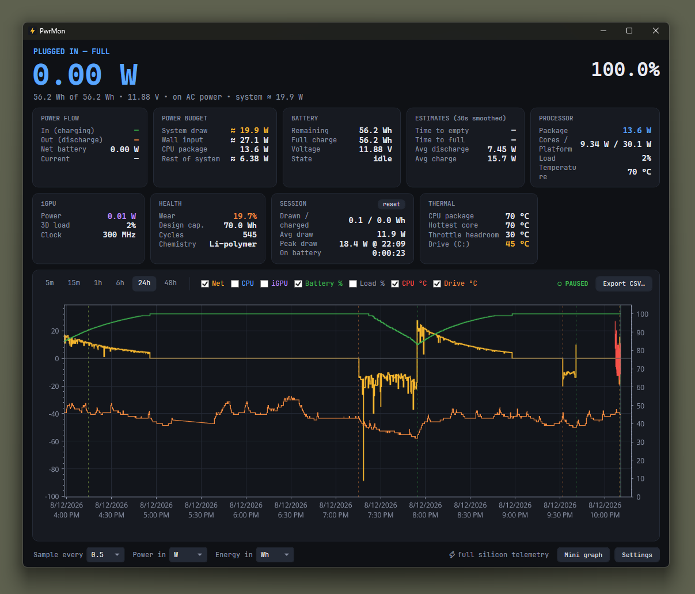
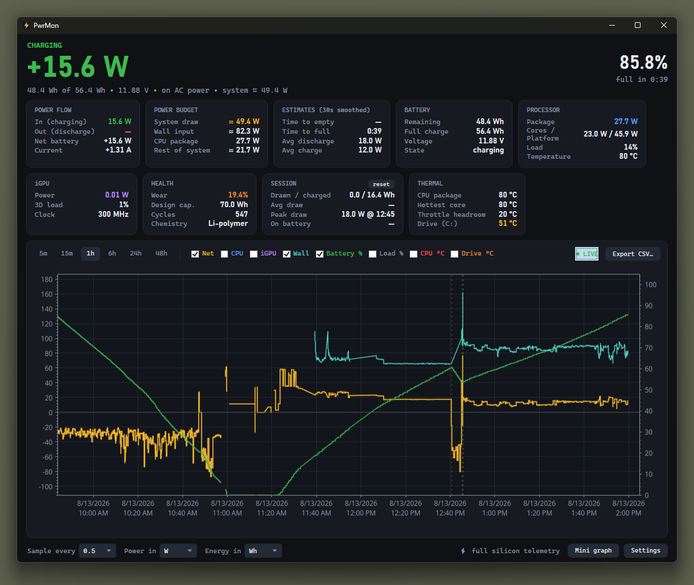
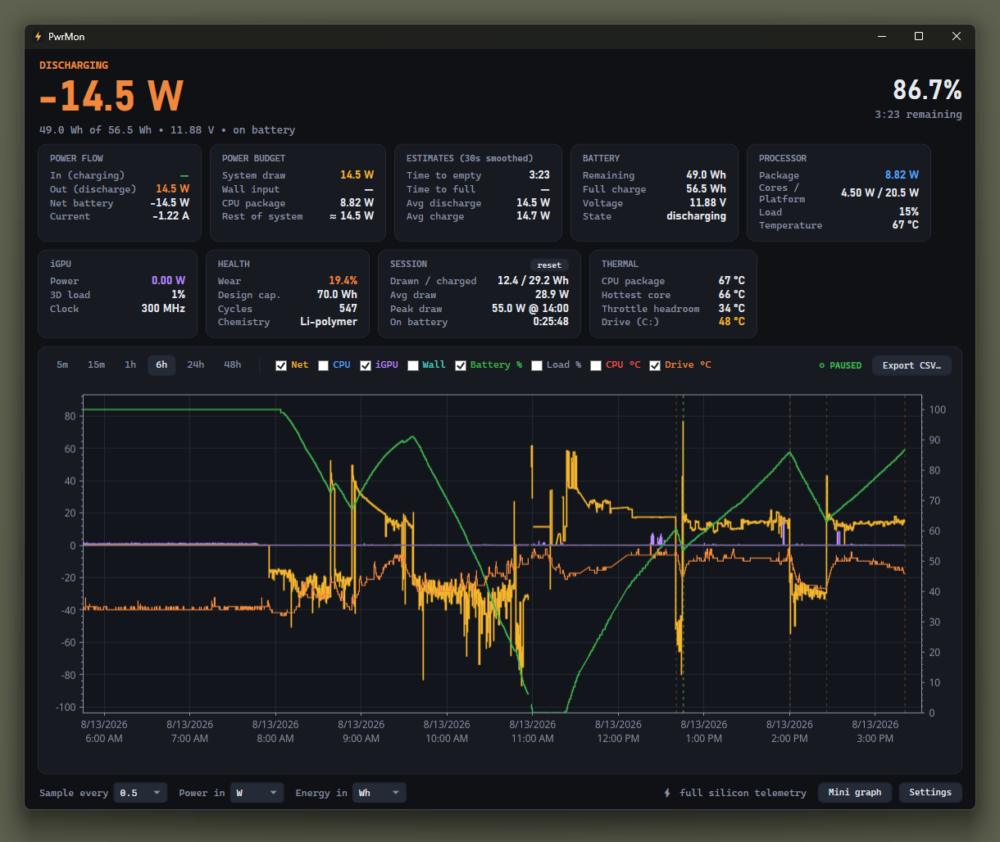
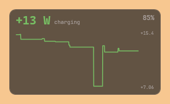
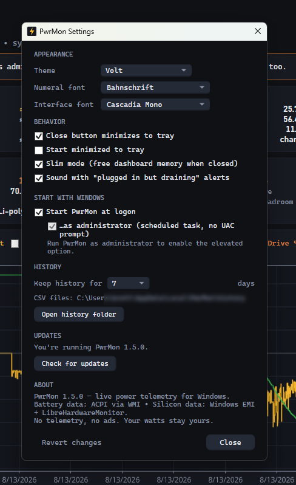

# ⚡ PwrMon

Live, real-time power telemetry for Windows PCs. 

No ads, no telemetry, no account. PwrMon only reaches the network when you press a button -
checking for updates, or downloading the optional PawnIO driver - and never in the
background.

<p align="center">
  
</p>

<p align="center">
  
  
  
</p>

<p align="center">
  
</p>

## What it shows

- **Live power flow** — charge/discharge wattage straight from the battery's fuel gauge
  (ACPI via WMI), plus net flow, voltage, and current. PwrMon polls as often as twice a
  second.
- **CPU & iGPU silicon power** — RAPL package, cores and iGPU watts with **no administrator
  and no kernel driver**, read from Windows' own Energy Meter counters. *Verified on Intel
  (12th–14th gen); untested on AMD — see [what needs work](#what-needs-work-and-how-you-can-help).*
  Elevation plus PawnIO adds platform (PSys) power and CPU temperatures. See "Sensor tiers"
  below.
- **Temperatures** — drive temperature read straight from the disk with no administrator or
  driver required, so it works in every tier; CPU package, hottest core and throttle headroom
  arrive with the full sensor tier. See "Temperature coverage" below for what isn't available.
- **History chart** — pan/zoomable multi-series chart (net W, CPU W, iGPU W, wall W,
  battery %, CPU load, CPU °C, drive °C) over 5 minutes to 48 hours, with AC plug/unplug
  and resume event markers.
  History persists across restarts (daily CSV files, configurable retention).
- **Time estimates that aren't (total) garbage** — time-to-empty / time-to-full computed from
  30-second smoothed rates, not Windows' famously bogus `EstimatedRunTime`.
- **Battery health** — wear % (design vs. actual full-charge capacity), cycle count,
  chemistry, design capacity.
- **Session stats** — energy drawn/charged this session, average and peak draw with
  timestamp, time on battery.
- **Tray ticker** — the live wattage (or battery %) rendered *as* the tray icon,
  color-coded: green charging, orange discharging, red heavy draw.
- **Floating mini-graph** — a borderless, translucent sparkline that stays out of the way.
  Plots any of eight series (net W, CPU W, iGPU W, wall W, battery %, CPU load, CPU °C,
  drive °C), each keeping the colour it wears on the history chart; click the graph to cycle
  between whichever ones you've enabled. Window lengths from 60 seconds to 24 hours,
  draggable, resizable from any edge or corner, optional always-on-top and click-through.
- **Plugged-in-but-draining alert** — when the charger is connected but the battery is
  going down anyway, PwrMon says so: a tray notification when the state is confirmed, and
  again at 50 / 35 / 20 / 15 / 10% on the way down. Windows sees "AC connected" and stays
  quiet, which is exactly how a laptop gets to flat while plugged in. Sound is on by
  default and can be turned off; the alerts themselves stay.
- **Self-update** — Settings → Updates checks for a new signed release, verifies it against
  a key compiled into the binary, and runs the installer. No background checks, nothing
  automatic; see [SECURITY.md](SECURITY.md).
- **Adjustable units** — W/mW, Wh/mAh, sampling interval 0.5–5 s.
- **CSV export** of any visible chart range.

## Getting it

Download the installer from the [latest
release](https://github.com/brettkcherry/PwrMon/releases/latest). PwrMon then keeps itself
up to date: Settings → Updates checks for a new signed release and verifies it against a key
compiled into the binary, only when you ask it to.

Releases are **not code-signed yet**, so Windows SmartScreen will warn on first run. Verify
the SHA-256 against the release notes before installing:

```powershell
Get-FileHash .\PwrMon-Setup.exe -Algorithm SHA256
```

## Project status — released, and tested on one machine

PwrMon runs daily on its author's machine and does what this README says it does. What it
hasn't had is contact with hardware other than that machine:

- Verified on exactly one laptop — a Zenbook UX3404VA (i7-13700H, Iris Xe).
- The driverless default tier is **confirmed on Intel only**. On AMD it is untested, so every
  claim about it in this README is scoped to Intel until someone shows otherwise.
- Battery telemetry uses standard ACPI interfaces and should be the most portable part; the
  silicon-power layer is the part most likely to behave differently on hardware it hasn't met.

Nothing here is a claim waiting to be verified — the claims are written to match what's
actually been observed, and they'll widen as hardware reports arrive. **A dump from a machine
where nothing works is worth as much as one where everything does** — see [what needs
work](#what-needs-work-and-how-you-can-help) below. The full punch list is in
[ISSUES.md](ISSUES.md).

The project page lives at [brettkcherry.github.io/PwrMon](https://brettkcherry.github.io/PwrMon/)
(source in [docs/](docs/)).

## What needs work, and how you can help

One thing is worth more than everything else combined: **a sensor dump from a machine that
isn't a 13th-gen Intel Zenbook.** Especially an AMD one.

Here's why that specific ask. PwrMon's headline claim is that it reads CPU and iGPU watts
with **no administrator and no kernel driver**, using Windows' own Energy Meter counters —
where effectively every comparable tool loads a driver, usually one on Microsoft's
vulnerable-driver blocklist. That path works. It's also been observed on exactly one CPU
family, which means that today it is an *Intel* claim wearing a general one's clothes. Nobody
can close that gap from this machine.

**`tools/SensorProbe` is the whole test.** It's a small console app that installs nothing,
elevates nothing, changes nothing, and needs no trust — it reads sensors, prints what it
found, and exits:

```powershell
dotnet run --project tools/SensorProbe
```

It writes a `sensorprobe-<timestamp>.txt` next to itself and prints the path. Attach that to
a [hardware report](https://github.com/brettkcherry/PwrMon/issues/new/choose) with your CPU,
GPU and Windows version.

**A dump where nothing works is exactly as useful as one where everything does** — "the EMI
counters don't exist on this chip" is a finding, and it's one that changes what this README is
allowed to claim. Please file it either way.

Also useful, in rough order:

- **Discrete GPUs.** PwrMon is integrated-graphics-focused today. Whether NVIDIA/AMD dGPU
  power is reachable without elevation is an open question worth answering.
- **Non-Intel iGPUs**, and Intel chips outside the 12th–14th gen range.
- **Anything in [ISSUES.md](ISSUES.md)** — that file is only what's still outstanding, and
  it's kept honest.

See [CONTRIBUTING.md](CONTRIBUTING.md) before opening a PR; the ethos section there is what
gets changes merged or bounced.


## Building

Requires the .NET 8 SDK.

```powershell
# one-time: generate the app icon
powershell -ExecutionPolicy Bypass -File tools/gen-icon.ps1

# debug run
dotnet run --project src/PwrMon

# both distributables, into the folders installer/PwrMon.iss expects
./tools/publish.ps1

# just one flavor
./tools/publish.ps1 -Only portable      # framework-dependent, ~27MB; needs .NET 8 Desktop Runtime
./tools/publish.ps1 -Only standalone    # self-contained, ~72MB; no runtime needed — what the installer ships
```

`tools/publish.ps1` is the source of truth for these two builds — read it before hand-typing a `dotnet publish` command, the flags matter:
- `IncludeNativeLibrariesForSelfExtract` is set in the csproj and is load-bearing: without it, `PublishSingleFile` still emits 11 native DLLs (`PresentationNative_cor3`, `wpfgfx_cor3`, `libSkiaSharp`…) alongside the exe, and moving the exe on its own gives `DllNotFoundException` in `HwndSubclass` as soon as a window opens.
- `EnableCompressionInSingleFile` roughly halves the standalone exe (162MB → 72MB on v1.4.0) since `PublishSingleFile` stores the bundled runtime uncompressed by default. It's skipped for portable — no runtime payload to compress there, so it'd only cost startup-time extraction for no size win.

## Sensor tiers (what needs elevation — and what doesn't)

PwrMon reads CPU/iGPU power from whichever of two sources is available, and prefers the one
that asks nothing of you:

| Tier | What you get | Requirement |
|------|--------------|-------------|
| **Default** — every user | Battery watts + health, **CPU/iGPU watts** via Windows' Energy Meter counters, CPU load, drive °C | nothing |
| **Full** — elevated | Everything above, **plus** CPU platform (PSys) power, package and hottest-core temperature, throttle headroom | admin + [PawnIO](https://pawnio.eu/), a signed HVCI-compatible sensor driver |

The default tier is the part most tools in this category don't have: no elevation, no kernel
driver, no UAC prompt, and unaffected by Memory Integrity. Elevation is an **upgrade** for
platform power and temperatures — not a prerequisite for watts.

Where a machine exposes no Energy Meter provider, the default tier has no CPU/iGPU watts and
the dashboard shows a banner with one-click fixes (restart elevated / get PawnIO / re-detect).
That path is verified on Intel; **it has not been tested on AMD** — see [ISSUES.md](ISSUES.md).

Battery wattage — the number that actually tells you your total system draw on battery —
works at every tier, elevated or not.

> On battery, **discharge rate = total system draw**.
> When plugged in, the wall draw isn't measurable on most laptops; you get charge rate
> into the battery plus CPU/iGPU silicon power.

## Temperature coverage

| Sensor | Source | Tier |
|--------|--------|------|
| Drive | `IOCTL_STORAGE_QUERY_PROPERTY` on a query-only volume handle | every tier — no admin, no driver |
| CPU package / hottest core / throttle headroom | LibreHardwareMonitor MSRs | admin + PawnIO, same as CPU watts |

As far as I have been able to tell **iGPU temperature is not available** on Intel integrated graphics. LibreHardwareMonitor exposes no temperature sensor for Intel GPUs; Level Zero Sysman
can't initialise on a stock driver install (no `HKLM\SOFTWARE\Khronos\OneAPI\LevelZero`
registration); Intel's IGCL `ctlEnumTemperatureSensors` returns `CTL_RESULT_ERROR_ZE_LOADER`
because it's implemented over Level Zero; and the kernel's own `D3DKMT` adapter perf data
returns zeros, which is why Task Manager shows no iGPU temperature either. Tools that do
report it load a kernel driver and read the GPU's thermal registers directly — see the
"No WinRing0" boundary in [SECURITY.md](SECURITY.md). On a monolithic mobile die the iGPU
shares the package thermal domain, so **CPU package temperature tracks it closely**.

Battery temperature is exposed by some machines through the WMI `BatteryTemperature` class;
where the class has no instances (as on this project's reference machine) there's nothing to
read. `tools/SensorProbe` reports all of the above for your hardware.

## Data & files

Everything lives in `%LocalAppData%\PwrMon\`:

- `settings.json` — preferences
- `history\history-YYYY-MM-DD.csv` — one file per day, pruned after the retention window
- `history\events.csv` — AC/resume event marks
- `logs\` — one file per day, pruned on the same retention window as history

## Architecture

```
src/PwrMon/
  Services/
    BatteryReader.cs    WMI root\wmi ACPI battery classes (rates mW, capacities mWh)
    HardwareReader.cs   Energy Meter counters + LibreHardwareMonitor, sensor-tier detection
    DriveTemperature.cs drive °C via a query-only volume handle (no admin, no driver)
    Sampler.cs          polling loop, EMA smoothing, session stats, AC/sleep events
    PowerMath.cs        pure power/energy formulas, lifted out of Sampler to be testable
    HistoryStore.cs     daily CSV persistence, backfill, retention, export
    TrayService.cs      dynamic GDI+ tray icon (live wattage as the icon)
    StartupHelper.cs    HKCU Run key / elevated Task Scheduler autostart (+ ACL safety check)
    Authenticode.cs     WinVerifyTrust signature check for the PawnIO download
    ThemeService.cs     runtime palettes + curated font lists
    UnitFormatter.cs    W/mW, Wh/mAh, duration formatting
    Log.cs              append-only daily log
  Views/
    MainWindow          dashboard: hero readout, stat cards, ScottPlot history chart
    MiniGraphWindow     borderless topmost sparkline
    SettingsWindow      behavior/autostart/history settings
src/PwrMon.Tests/       xUnit bench over the pure logic — see TESTING.md
tools/
  SensorProbe/          console dump of every sensor this machine exposes
  gen-icon.ps1          renders Assets/app.ico
  list-shipped-assemblies.ps1  reconciles THIRD-PARTY-NOTICES against deps.json
```

Dependencies: [LibreHardwareMonitorLib](https://github.com/LibreHardwareMonitor/LibreHardwareMonitor) (MPL-2.0),
[ScottPlot](https://scottplot.net/) (MIT), System.Management, System.Diagnostics.PerformanceCounter
(the Energy Meter path), System.Threading.AccessControl. Everything that ships — including
transitive components — is listed in [THIRD-PARTY-NOTICES.md](THIRD-PARTY-NOTICES.md).

## Privacy & security

- **No telemetry, no analytics, no crash reporting.** Nothing about you or your machine is
  ever sent anywhere. PwrMon makes a network request only when you press a button: checking
  for updates (Settings → Updates), and the optional PawnIO installer download. There is no
  background check, no automatic download, and no silent install — see
  [SECURITY.md](SECURITY.md) for how an update is verified before it is allowed to run.
- **No WinRing0.** Most tools in this category read CPU power through WinRing0, a driver on
  Microsoft's vulnerable-driver blocklist. PwrMon doesn't ship it and never loads it — the
  default path uses Windows' own Energy Meter counters (no driver, no elevation), and the
  optional upgrade path is PawnIO, which is HVCI-compatible and signed.
- **Elevation is optional and never silent.** Battery telemetry needs none. The PawnIO
  download is signature-verified and its signer shown to you before anything runs.
- **Your data stays local.** Everything is under `%LocalAppData%\PwrMon\` and pruned on the
  retention window you set. Battery/CPU telemetry only — no identifiers are recorded.

Found something? See [SECURITY.md](SECURITY.md).

## Known issues

Open bugs and the punch list live in [ISSUES.md](ISSUES.md).

## License

**PwrMon is free software under the [GNU GPL-3.0](LICENSE)**, and separately available under a
[commercial license](COMMERCIAL-LICENSE.md).

In plain English, because nobody should have to read a license to know where they stand:

- **Using PwrMon?** Free, forever, for anything including at work. Nothing is asked of you.
- **Reading, forking, modifying, packaging it?** Go ahead. If you distribute something built
  on it, that has to be GPL-3.0 with source too — it's the only
  obligation the license creates.
- **Contributing?** Inbound is GPL-3.0 plus a one-time [CLA](CLA.md). You keep your copyright.
  Bug reports and hardware dumps need no agreement at all.
- **Want to ship it inside a closed-source product?** That's what the
  [commercial license](COMMERCIAL-LICENSE.md) is for — including the driverless RAPL sensor
  layer on its own.
- **Forking it?** Rename it. The code is open; the name and icon aren't — see
  [TRADEMARK.md](TRADEMARK.md).

Third-party components keep their own licenses; see
[THIRD-PARTY-NOTICES.md](THIRD-PARTY-NOTICES.md). PawnIO is never bundled — it's downloaded
by you, from its own source, only if you ask for it.

Copyright © 2026 Brett Cherry.
